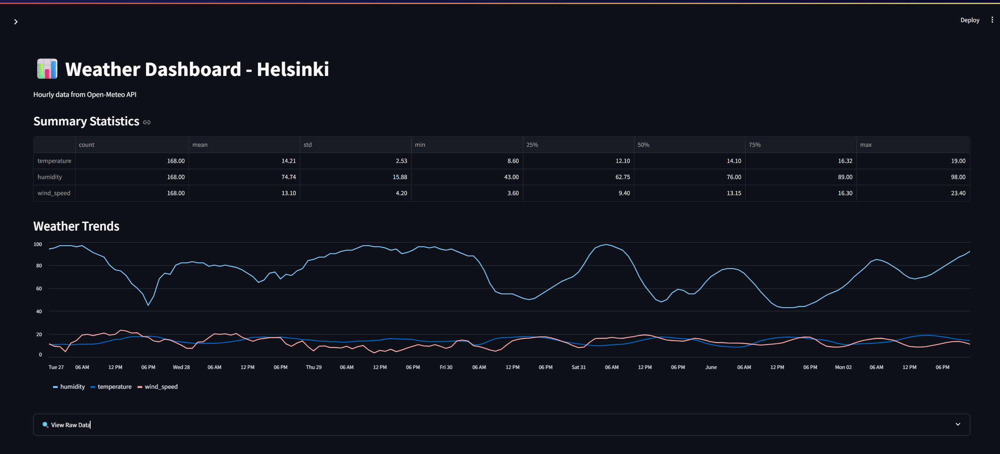
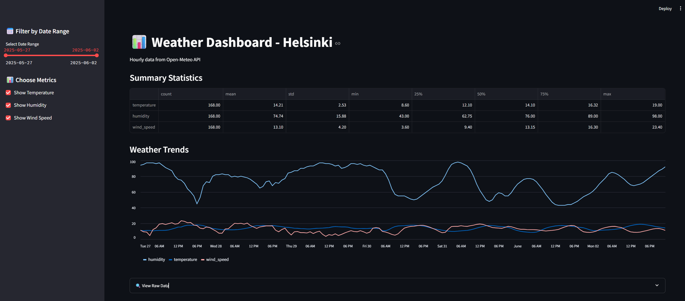

# 📊 Smart Energy Insights from Finnish Weather Data

## 🧩 Project Overview

This project builds a complete data pipeline that ingests real-time weather data from the Finnish Meteorological Institute (FMI), combines it with public or simulated energy consumption data, and delivers insights into how temperature patterns affect energy demand across Finland.

The solution includes data ingestion, transformation, automation, and visualization in a dashboard. The entire project is designed using industry best practices with a strong emphasis on local relevance to the Finnish energy and sustainability sector.

---

## 🎯 Objectives

- Ingest weather data (temperature, humidity, wind speed) from FMI or open weather APIs.
- Store raw data and processed data in a PostgreSQL database.
- Clean and transform weather data for trend and seasonal analysis.
- Correlate with energy consumption data from Fingrid (or simulated values).
- Build an automated daily data pipeline using Python and Airflow (or schedule).
- Create an interactive Streamlit dashboard showing temperature vs. energy usage trends.

---

## 🛠️ Tools and Technologies

| Layer              | Technology                    |
|-------------------|-------------------------------|
| Ingestion         | Python `requests`, `schedule` |
| Storage           | PostgreSQL, SQLAlchemy         |
| Transformation    | Pandas, SQL                    |
| Automation        | Apache Airflow (optional)      |
| Visualization     | Streamlit, Plotly              |
| Documentation     | Markdown, Lucidchart           |
| Version Control   | Git, GitHub                    |

---

## 📷 Screenshots

### Dashboard Overview  


### Sidebar Filters  


---

## 🧠 Architecture

```plaintext
Open-Meteo API
↓
fetch_weather_data.py
↓
parse_weather_data.py
↓
save_to_postgres.py
↓
PostgreSQL DB
↓
Streamlit Dashboard

---

## 📁 Folder Structure

fmi-energy-pipeline/
├── scripts/
│   ├── fetch_weather_data.py
│   ├── parse_weather_data.py
│   └── save_to_postgres.py
├── dashboard/
│   └── weather_dashboard.py
├── data/
│   └── [weather_*.json]
├── assets/
│   ├── dashboard_main.png
│   ├── dashboard_filters.png
│   └── architecture.png
├── README.md
├── requirements.txt
└── .gitignore


📦 Setup Instructions
1. Install dependencies

pip install -r requirements.txt

2. Run the pipeline

python scripts/fetch_weather_data.py
python scripts/parse_weather_data.py
python scripts/save_to_postgres.py

streamlit run dashboard/weather_dashboard.py


👤 Author
Vitus Idi
[\[text\](https://github.com/galapoto/)]
[text](https://www.linkedin.com/in/vitus-idi-70524718/)

📃 License
This project is open source under the MIT License.